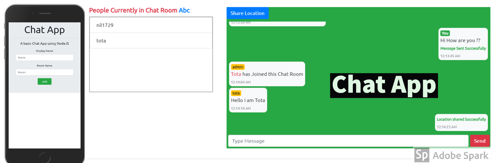

# Chat App

- #### This site is live [here](https://chat-nil.herokuapp.com/).
- #### Github Repository [link](https://github.com/nil1729/chat-io-nodejs).

---

### Modules used for this Project

1. `Node JS` is used for creating our Backend Server
2. `Express JS` is used as Node JS Framework.
3. `Socket.io` for realtime communication between cient and Server.
4. **Share Location** by using `Geo Location` and `opencagedata` API.
5. Avoid to send Bad Words using `bad-words` module.

---

### Website Preview

---

Made With &#10084; by <a href="https://github.com/nil1729" target="_blank"> Nilanjan Deb </a> 

